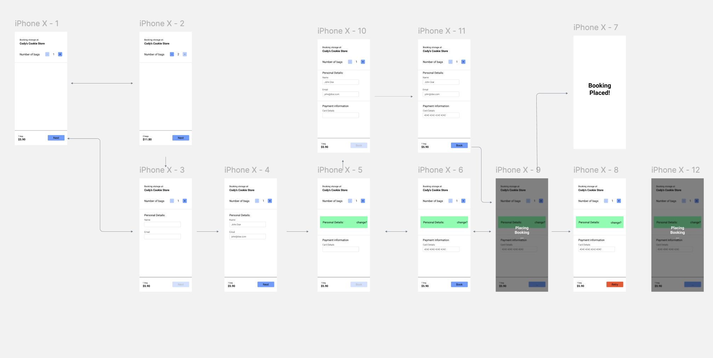

# Multi Schema Checkout

## Goals

The objective of this project is to create a checkout with a level of complexity and following a pre-defined UX design.

## Mockup



https://www.figma.com/file/6e6aS0zKBrPST8KSWN2CcS/Booking-Flow?node-id=1%3A3604

## What's inside?

This project is a MonoRepo which includes the following packages:

### Apps and Packages

- `@bounce/web`: a [React.js](https://nextjs.org/) app
- `@bounce/api`: a RestAPI
- `@bounce/eslint-config`: `eslint` configurations
- `@bounce/tsconfig`: `tsconfig.json`s used throughout the monorepo
- `@bounce/prettier`: `prettier` configurations

## Prerequisites

To be able to run this project you need:
- node >= 18 (https://nodejs.org/)
- pnpm (https://pnpm.io/) as package manager

## Install Packages

Before build or running this project you need to:

```
cd bounce-checkout
pnpm install
```

## Build

To build all apps and packages, run the following command:

```
cd bounce-checkout
pnpm build
```

## Develop

To develop all apps and packages, run the following command on monorepo root:

```
cd bounce-checkout
pnpm dev
```

ps.: By running dev all server apis are mocked by MSW handlers

## Tests

### Web App e2e tests

To run web app e2e test get in web app directory

```
cd bounce-checkout/apps/web
pnpm e2e:test
```

You can still run e2e tests in ui mode

```
cd bounce-checkout/apps/web
pnpm e2e:test:ui
```

### Web App integration tests

To run web app e2e test get in web app directory

```
cd bounce-checkout/apps/web
pnpm test
```

## Features

### Checkout

- [ ] It should be able to select the number of bags to be stored;
- [ ] It should be able to fill personal details;
- [ ] It should be able to update personal details before submit;
- [ ] It should be able to fill payment information;
- [ ] It should be able to submit checkout the block a storage spot;
- [ ] It should be able to retry submit if anything happens during the request submit process;

## Other Docs

You can follow a Kanban Board created for this project where all tasks and features were planned, refined and developed.
You will find it on Projects tab in this repository.

## Pipelines

For this MVP version you can find a pipeline setup for staging environment.
To run it is just necessary push any code on staging branch to fire the github actions

